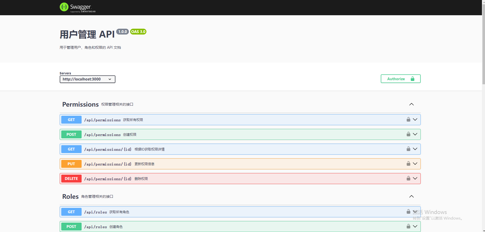
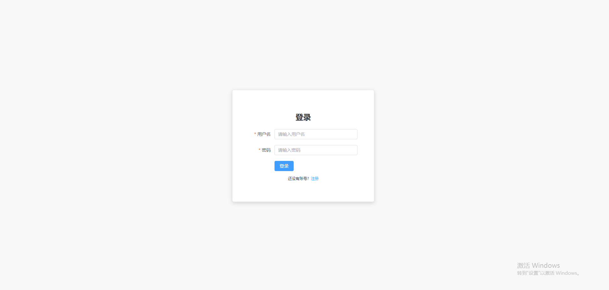
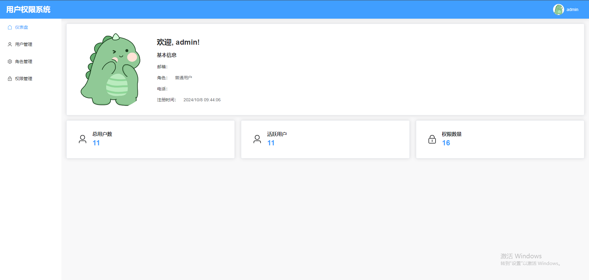
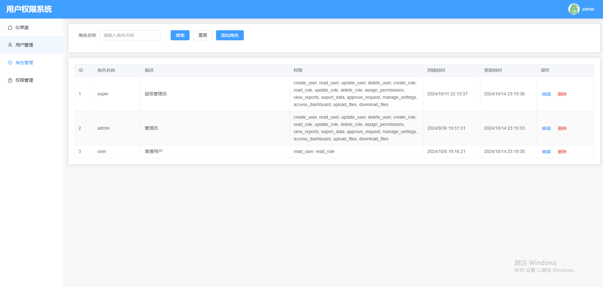
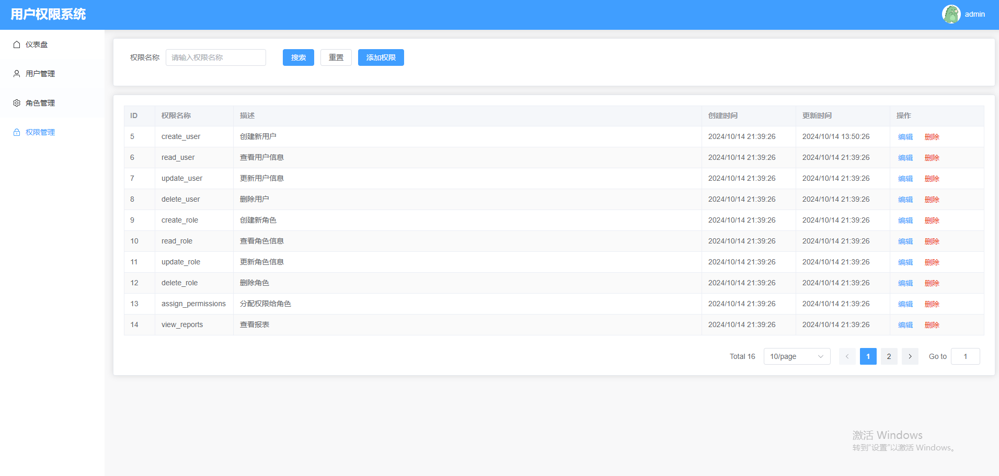

# vue3+node+typescript全栈项目

#### 介绍
vue3 + express + typescript + mysql + Sequelize 全栈从零构建的一个用户认证与授权系统。

#### 项目结构

#### 安装教程
#### 后端 backend
1.  npm install
2.  npm run dev
3.  npm run build

swagger文档地址：http://localhost:3000/api-docs

#### 前端 frontend

1.  npm install
2.  npm run dev
3.  npm run build

#### 项目截图
swagger文档

登录页面

首页

角色管理

权限管理

#### 参与贡献

1.  Fork 本仓库
2.  新建 Feat_xxx 分支
3.  提交代码
4.  新建 Pull Request
